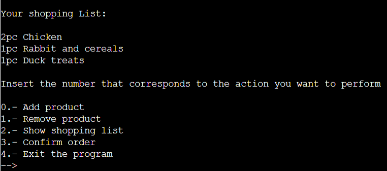

# Pets Order

It is a terminal program that runs on Heroku.

In this program, users will be able to insert the name and weight of their pet to determine the daily and monthly amount that their pet should eat.

Once the name and weight have been inserted, the user will find a list of actions that they can carry out. The user will be able to create an order, delete a product, view their shopping list, place the order or exit the program.

[You can find the program in this link](https://dogs-order.herokuapp.com/)

# How to use and Features

First, the name of the pet will be inserted. Then we will enter the weight, it has to be a number since otherwise, it will return an error until it is correct. Once a valid value is entered, a message will appear with the daily and monthly amount of food recommended for your pet.

## Main menu

Once this is done, five different actions that the user can do will appear. The user must insert the number corresponding to the action he wants to do.

## Add Product

To add a product to the list we must insert the number 0, when inserting it a list will appear with the available products and their respective price. To choose one we must insert the corresponding number, in this case we are inserting a chicken feed. When we insert a product, a confirmation message appears saying that the product has been added successfully and we return to the home page. If we want we can continue inserting more products. In the event that a number is inserted that does not correspond to the products shown, an error message appears and the option to insert an available one is given again.

## Remove Product

If we have made a mistake or want to remove a product from the main menu we must insert the number 1. In this option, we see a list of all the products we have. To eliminate one of them we insert the corresponding number. If we insert a number that is not valid, it will show us an error message, otherwise, the product will be successfully removed and it will return to the main menu. I am going to delete the fourth product, which corresponds to salmon feed

## Show Shopping List

You can also see the shopping list from the main menu by inserting the number 2. On that screen, we show a list with all the products we have and the units we have ordered. After that, it takes you to the main menu. There you can add or remove a product again.

## Confirm Order 

When you are satisfied with your order and want to finalize it, in the main menu you must enter the number 3. A list with all the added products and their respective prices is displayed. The order total and a confirmed order message are also displayed. 

## Exit the program

When the order is confirmed, you return to the main menu in case you want to place another order. If you do not want to carry out any further action, you must enter the number 4, this will cause you to exit the program.

# Data Model

I decided to create global variables, feed and prices are to save the products and their cost, on the other hand, action_list saves the list of actions that the user can perform. Purchase saves the selected products, totalPrice their respective prices and sumTotalPrice the total price of the order.

To save the dog information entered and calculate the daily and monthly amounts of feed create the dogInfo class. Create some functions that iterate through the tuple created with different actions, some iterate through two tuples and enumerate it, others only through one and enumerate it and another only iterate through the tuples. Thanks to this I only created the function once and I was using them in the different cases that I needed

The create_order function creates a loop that validates what number has been entered in the main menu and, based on that digit, performs the different actions. In this case, I also create separate functions for each procedure and call them in the create_order function. I decided to do it like this because I see the code as more clean and scalable since if I want to perform other actions or change the products I just have to implement it and not change the structure of the code itself. Finally, create the main function that invokes the calculation of the DogInfo class and create_order.

# Testing

I tested the code in PEP8 and it has no errors. 

## Bugs

I did not have bugs, rather I ran into some difficulty such as the fact that the calculation of the quantities had to be divided by 1000 so that they would give me quantities that the user understood. I also had to do quite a bit of research to be able to solve the problems I ran into walking through and displaying the numbered tuples or calculating the repeating products.

## Remaining Bugs

No remaining bugs.

# Deployment

I deployed at work on Heroku. The steps that I followed were the following:

* I logged into Heroku and created a new application called dogs_order
* In the settings section:
    * Config Vars --> KEY: PORT/VALUE: 8000
    * Buildpacks  --> Heroku/Python and Heroku/Node.js in that same order
* In the Deploy section:
    * Deployment method       --> Github
    * App connected to GitHub --> I connected the project repository with Heroku.
    * Deploy method           --> At first I did it manually and then I activated the automatic option so that every time a change is made in the repository, it also does it in the app.

# Credits

* I was inspired by this video to decide the structure of the project:
    *  [on this channel](https://www.youtube.com/watch?v=iej0zsAFilY)
* To create a list by looping through two tuples and enumerating them:
    *  [https://pharos.sh/como-iterar-sobre-un-diccionario-en-python/](https://pharos.sh/como-iterar-sobre-un-diccionario-en-python/)
* To calculate how many times an element appears in a tuple: 
    *  [https://www.it-swarm-es.com/es/python/](https://www.it-swarm-es.com/es/python/como-encontrar-todas-las-apariciones-de-un-elemento-en-una-lista/972456523/)
